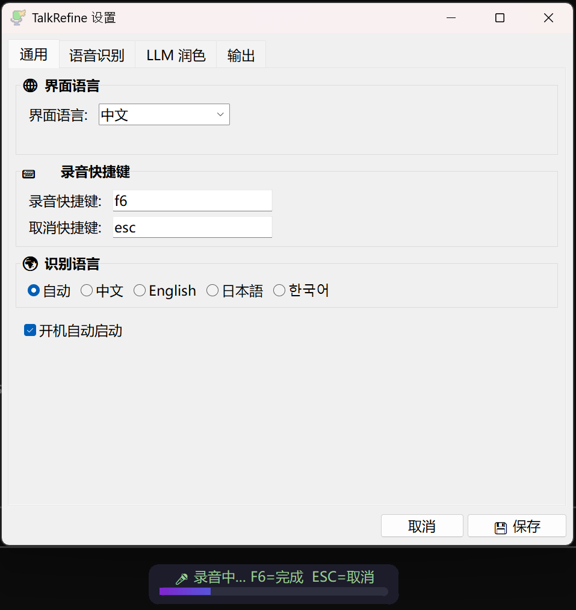

# 🎤 TalkRefine

**自然说话，输出精炼文字。** 本地离线语音输入 + LLM 润色工具。

按快捷键 → 说话 → 本地 ASR 模型转写 → 本地 LLM 润色为书面语 → 自动粘贴到光标位置。全程离线，隐私安全。

## 特性

- 🗣️ **语音 → 文字 → 精炼文字**，一步到位
- 🔒 **完全离线**，数据不出本机
- ⚡ **极速**，10 秒语音不到 1 秒识别，LLM 热状态 ~1-2 秒完成润色
- 🌍 **多语言**，中文、英文、日文、韩文等
- 🧠 **可插拔引擎**，通过配置文件切换 ASR 模型和 LLM（llama.cpp / Ollama / OpenAI）
- 📋 **智能粘贴**，自动粘贴到光标，剪贴板内容不丢失
- 🎨 **现代 UI**，圆角浮窗 + AI 渐变音量条 + 系统托盘
- 🌍 **中英双语界面**，设置中一键切换
- 📜 **历史记录**，500 条，支持搜索、复制原文/润色结果
- 🔄 **自动发现模型**，llamacpp 自动下载 GGUF，Ollama 自动列出已安装模型
- 🔑 **可靠热键**，基于 Win32 RegisterHotKey API，锁屏/任务管理器后不丢失
- 💾 **智能内存管理**，锁屏自动释放 LLM 内存，解锁自动恢复

## 效果演示

```
🎙️  说话: "嗯就是我觉得吧这个东西有三个问题，第一个就是速度太慢了，
          然后那个界面不好看，然后就是不支持中文对吧"

✨ 输出: - 速度太慢
        - 界面不好看
        - 不支持中文
```

## 截图



## 快速开始（Windows）

### 一键安装

```powershell
git clone https://github.com/swenyang/talk-refine.git
cd talk-refine
.\scripts\install.ps1
```

自动安装 Python 依赖、ffmpeg、GGUF 模型，并设置开机自启。Ollama 不再是必需组件。

### 手动安装

```powershell
# 1. 安装系统依赖
winget install Gyan.FFmpeg

# 2. 安装 Python 包（含 llama-cpp-python）
pip install torch torchaudio --index-url https://download.pytorch.org/whl/cpu
# 优先使用预编译 wheel（仓库 wheels/ 目录下有 Windows x64 版本）
pip install wheels/llama_cpp_python-0.3.20-py3-none-win_amd64.whl
pip install funasr modelscope pyaudio pyperclip pyautogui requests pystray Pillow pyyaml huggingface_hub

# 3. GGUF 模型会在首次启用 LLM 时自动下载（~2.6GB）
#    或手动下载：
python -c "from huggingface_hub import hf_hub_download; hf_hub_download('unsloth/Qwen3.5-4B-GGUF', 'Qwen3.5-4B-Q4_K_M.gguf', local_dir=str(__import__('pathlib').Path.home() / '.talkrefine/models'))"

# 4. 运行
python -m talkrefine
```

> 💡 也可使用 Ollama 作为 LLM 后端（需额外安装 `winget install Ollama.Ollama && ollama pull qwen3.5:2b`），在设置中将 provider 切换为 `ollama` 即可。
> 
> 💡 `wheels/` 目录包含预编译的 `llama-cpp-python` Windows wheel（~7MB），免去本地编译 C++ 的麻烦。也可从 [GitHub Releases](https://github.com/swenyang/talk-refine/releases) 下载或自行 `pip install llama-cpp-python` 编译。

## 使用方法

1. 启动（开始菜单搜 `TalkRefine`，或 `python -m talkrefine`）
2. 按 **F8** 开始录音
3. 自然说话
4. 按 **F8** 停止 → 自动识别、润色、粘贴
5. 按 **ESC** 取消录音（丢弃不处理）

系统托盘图标（右下角）→ 右键菜单：
- 开关 LLM 润色
- 退出程序

## 配置

复制 `config.example.yaml` 为 `config.yaml`，按需修改：

```yaml
hotkey: "F8"              # 录音快捷键（f9, ctrl+shift+r 等均可）
cancel_key: "esc"         # 取消录音
language: "auto"          # "auto", "zh", "en", "ja", ...

asr:
  engine: "sensevoice"    # "sensevoice"（中文最佳）| "whisper"（多语言）
  model: "FunAudioLLM/SenseVoiceSmall"
  device: "cpu"           # "cpu" | "cuda"
  hub: "hf"               # "hf"（HuggingFace）| "ms"（ModelScope，国内推荐）

llm:
  enabled: true
  provider: "llamacpp"    # "llamacpp"（轻量）| "ollama" | "openai"（兼容 API）| "none"
  model_path: ""          # .gguf 文件路径（llamacpp 使用）
  endpoint: "http://localhost:11434"  # Ollama/OpenAI 端点
  model: "qwen3.5:2b"
  prompt: "default"       # "default"（prompts/default.txt）| 自定义 .txt 路径

output:
  auto_paste: true        # 自动粘贴到光标
  preserve_clipboard: true  # 粘贴后恢复剪贴板
```

### ASR 引擎

| 引擎 | 适合场景 | 模型大小 | 速度 |
|------|----------|----------|------|
| **SenseVoice**（默认） | 中文 | ~200 MB | ⚡ 极快 |
| **Whisper** | 多语言 | 500MB-3GB | 中等 |

### LLM 提供者

| 提供者 | 配置方式 | 额外安装 | 适用场景 |
|--------|----------|----------|----------|
| **llama.cpp**（默认） | 设置 model_path 或留空自动下载 | ~2.6 GB GGUF 模型 | 轻量离线，无需外部服务，推荐 |
| **Ollama**（可选） | `ollama pull qwen3.5:2b` | Ollama 服务 + ~2 GB 模型 | 多模型管理，需安装 Ollama |
| **OpenAI 兼容** | 设置 endpoint + api_key | — | 云端 LLM（OpenAI、DeepSeek、vLLM 等） |
| **None** | — | — | 仅转写，不润色 |

### Prompt 模板

内置模板 `prompts/default.txt`：通用去口水词、自动分点。

在 Settings UI 中可直接编辑 prompt，并通过 **"restore default"** 按钮恢复默认。也可创建自定义 `.txt` 文件，将 `llm.prompt` 设为文件路径。

## 系统要求

| | 最低 | 推荐 |
|---|------|------|
| CPU | 4 核 | 8 核+ |
| 内存 | 32 GB | 32 GB+ |
| GPU | **不需要** | — |
| 磁盘 | ~3 GB | ~5 GB |
| 系统 | Windows 10+ | Windows 11 |
| Python | 3.10-3.12 | 3.12（3.13 暂不支持） |

### 默认模型资源占用（实测）

| 组件 | 模型 | 内存占用 | 说明 |
|------|------|----------|------|
| **ASR** | SenseVoice-Small | ~3 GB | 加载后常驻（Python 进程内） |
| **LLM (llama.cpp)** | Qwen3.5-4B-Q4_K_M | ~4 GB | 进程内加载，~2s 推理，无额外服务开销 |
| **LLM (Ollama)** | Qwen3.5:2b | ~2 GB 模型 + Ollama 服务 | 需额外安装 Ollama（可选） |

> 💡 **推荐使用 llama.cpp 提供者**（默认）：无需安装额外服务，首次使用自动下载 ~2.6GB GGUF 模型到 `~/.talkrefine/models/`。锁屏时自动卸载模型释放内存，解锁后自动恢复。

### 使用模式对比

| 模式 | LLM 后端 | 总内存 | 说明 |
|------|----------|--------|------|
| **仅语音识别** | 无 | ~3 GB | 只做语音→文字，不润色 |
| **语音识别 + llama.cpp 润色**（推荐） | llama.cpp | ~7 GB | 轻量离线润色，无需额外服务 |
| **语音识别 + Ollama 润色** | Ollama（可选） | ~5 GB + Ollama 服务 | 需安装 Ollama |

### 智能内存管理

开启 LLM 润色时，TalkRefine 自动管理模型内存（llama.cpp 和 Ollama 均支持）：

| 场景 | 行为 | LLM 内存 |
|------|------|----------|
| 正常使用 | 模型常驻内存，响应 ~1-2 秒 | ~4 GB (llama.cpp) |
| **锁屏离开** | 自动卸载模型（`del` + `gc.collect()`） | **释放** |
| **解锁回来** | 自动重新加载 | 恢复 |
| 设置中关闭 LLM | 后台线程卸载模型 | **释放** |
| 设置中开启 LLM | 后台线程加载模型 | 恢复 |

> 💡 不需要 LLM 润色的用户无需下载 GGUF 模型或安装 Ollama，TalkRefine 仅用 SenseVoice 做语音识别（~3GB）也很好用。

## 架构

```
┌────────────┐    ┌─────────────┐    ┌──────────────┐    ┌──────────┐
│   麦克风   │───▶│  ASR 引擎   │───▶│  LLM 润色    │───▶│ 自动粘贴 │
│  (PyAudio) │    │ SenseVoice  │    │ llama.cpp /  │    │ (剪贴板  │
│            │    │ 或 Whisper  │    │ Ollama/OpenAI│    │  恢复)   │
└────────────┘    └─────────────┘    └──────────────┘    └──────────┘
```

```
assets/                     # 图片资源
├── screenshot.png          #   截图
├── talkrefine.ico          #   应用图标
└── talkrefine.png          #   应用图标（PNG）
run.pyw                     # 启动器（双击运行，无控制台窗口）
talkrefine/
├── app.py              # 主应用
├── config.py           # 配置加载
├── history.py          # 历史记录（搜索、导出）
├── recorder.py         # 录音模块
├── asr/                # 语音识别引擎（可插拔）
│   ├── base.py
│   ├── sensevoice.py   #   阿里 FunASR SenseVoice
│   └── whisper.py      #   OpenAI Whisper
├── llm/                # LLM 润色（可插拔）
│   ├── base.py
│   ├── llamacpp.py     #   llama.cpp（轻量本地，默认推荐）
│   ├── ollama.py       #   本地 Ollama
│   ├── openai_compat.py#   OpenAI 兼容 API
│   ├── none.py         #   直通（不润色）
│   └── prompts.py      #   Prompt 模板加载
├── platform/           # 平台适配
│   ├── windows.py      #   快捷键、粘贴、自启动
│   ├── hotkeys.py      #   Win32 RegisterHotKey（可靠热键）
│   └── session_monitor.py  #   锁屏/解锁检测（内存管理）
└── ui/
    ├── icon.py         #   图标加载
    ├── overlay.py      #   悬浮音量条（AI 渐变）
    ├── settings.py     #   设置界面（i18n）
    └── tray.py         #   系统托盘
```

## 开机自启 & 快捷方式

```powershell
python -m talkrefine --install      # 添加开机自启 + 开始菜单
python -m talkrefine --uninstall    # 移除
```

## 卸载

```powershell
# 1. 移除自启和快捷方式
python -m talkrefine --uninstall

# 2. 卸载 Python 包
pip uninstall funasr modelscope torch torchaudio pyaudio -y

# 3. 删除模型缓存
Remove-Item -Recurse -Force "$env:USERPROFILE\.talkrefine\models"
Remove-Item -Recurse -Force "$env:USERPROFILE\.cache\modelscope"

# 4. 卸载 Ollama（如果安装了）
# winget uninstall Ollama.Ollama
# Remove-Item -Recurse -Force "$env:USERPROFILE\.ollama"
```

## License

MIT
